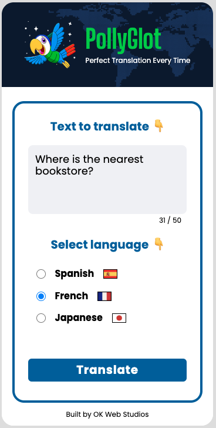
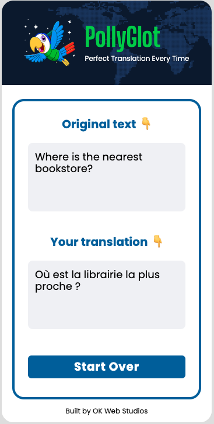

<h1 align="center">AI Translator App</h1>

<p align="center">
  &nbsp;&nbsp;&nbsp;&nbsp;&nbsp;&nbsp;
  
</p>

This translation web application allows users to input text and translate it into multiple languages using OpenAI's translation capabilities. The application is designed to help bridge language barriers, making it easier to communicate across different languages.

## Table of Contents
- [Features](#features)
- [Technologies Used](#technologies-used)
- [Installation Instructions](#installation-instructions)
- [Usage](#usage)
- [Deployment](#deployment)
- [Future Enhancements](#future-enhancements)
- [Contributions](#contributions)
- [License](#license)
- [Acknowledgements](#acknowledgements)

## Features
- **Text Translation**: Translate text from English to multiple languages (Spanish, French, Japanese).
- **Interactive UI**: User-friendly interface to input text and select languages.

## Technologies Used
- HTML, CSS, JavaScript
- Node.js and Express
- OpenAI API (gpt-3.5-turbo)
- Vite.js

## Running Locally

### Prerequisites
- [Node.js](https://nodejs.org/en/)
- [npm](https://www.npmjs.com/)
- [OpenAI API key](https://platform.openai.com/account/api-keys)

### Steps
1. Clone the repository (make sure to replace 'your-username' with your GitHub username):
  ```sh
  git clone https://github.com/your-username/ai-translator-app.git
  ```

2. Navigate to the project directory:
  ```sh
  cd ai-translator-app
  ```

3. Install dependencies:
  ```sh
  npm install
  ```

4. Start the server:
  ```sh
  npm start
  ```

## Usage
1. **Input Text**: Enter the text you want to translate in the provided text box.
2. **Select Language**: Choose the target language for translation.
3. **Translate**: Click the "Translate" button to get the translated text.
4. **View Translation**: The translated text will be displayed in the output area.

## Deployment
The application is deployed on Netlify and can be accessed [here](https://pollyglot-ai-app.netlify.app).

## Future Enhancements
- **More Languages**: Expand the application to support translation into additional languages beyond the current set.
- **Text-to-Speech**: Implement text-to-speech functionality to read translations aloud using OpenAI's TTS API.
- **Voice Input**: Add the ability for users to input text via voice using OpenAI's Whisper API.
- **Improved UI**: Enhance the user interface for better user experience and accessibility.

## Contributions
Contributions are welcome! Please follow these guidelines:
- Fork the repository.

- Create a new branch:
  ```sh
  git checkout -b feature/new-feature
  ```

- Make your changes and commit them: 
  ``` sh
  git commit -m 'Add new feature'
  ```

- Push to the branch:
  ```sh 
  git push origin feature/new-feature
  ```

- Submit a pull request.

## License
This project is licensed under the MIT License.

## Acknowledgements
This project is part of [Scrimba](https://v2.scrimba.com/)'s [AI Engineering Course](https://v2.scrimba.com/the-ai-engineer-path-c02v)
